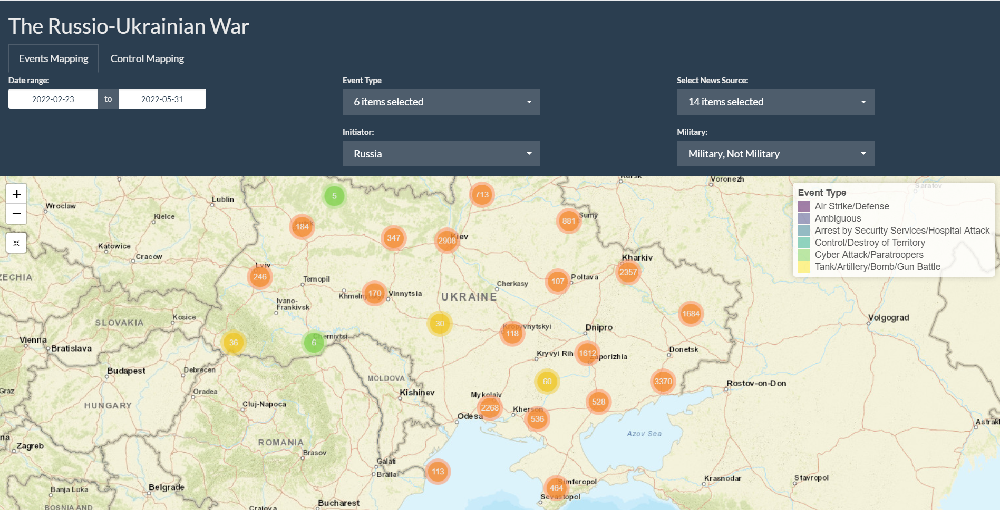
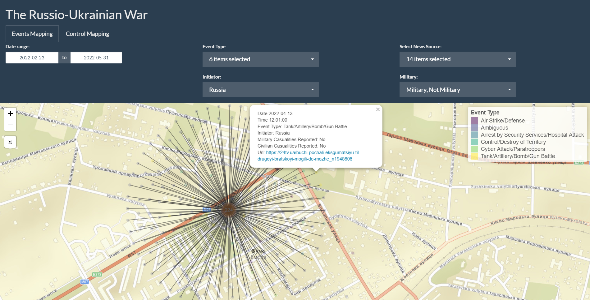

```{r load-packages, echo = FALSE, include = FALSE, message=FALSE}
library(tidyverse)
library(styler)
library(here)
```

# Introduction

In this project, we plan to build a Shiny app with interactive plots to visualize Russian-Ukraine crisis, which will help calling people's attention, and recover deep insights to make peace.

Russian-Ukraine crisis is a long lasting problem and it caused countless casualties nearly everyday. The earliest big confrontation can be dated back to 2014, when pro-Russian separatists in two cities in Ukraine, Donetsk and Luhansk, started revolts. From 2014 to 2022, there were several small military events and non-military but violent events happened in Ukraine in the area close to the Russian-Ukrainian border. In 2022, allegedly concerned with the potential Eastward expansion of NATO, Russia started a war against Ukraine by attacking targets in the whole country using air weapons and by invading its land territory from multiple sides at the same time. Millions of refugees fled the country, dozens of thousands of people including civilians have been killed in targeted and untargeted attacks, many people have been tortured and robbed of their life assets, and many cities have been destroyed within several weeks. In this project, we want to build a shiny app to illustrate the military events happened during the recent 2022 Russia-Ukraine war and keep track of the territory boundary or military marching of soldiers from two sides.

We have chosen this topic, because all of us are concerned about international confrontations. We wish the world were peaceful and there were no wars or violent events anymore. 

We are also motivated by the opportunity of enhancing the study of the war in its specific aspects, such as place has the most attackers or military actions, and which side has the relative advantages as the battles continue. If we can plot every single events on a map, we will be able to discover some patterns such as which area or city has the most violent event happen. Perhaps insights with tools such as ours could be somehow used prevent the same attacks from happening again. 

We want to use shiny app and interactive plots to live demonstrate the process of Russia-Ukraine war, including the territory movement, military and non-military events across different timeframes. 


# Data
We will use the VIINA (Violent Incident Information from News Articles on the 2022 Russian Invasion of Ukraine) data set collected by Professor Yuri Zhukov from the University of Michigan (see [full list here](https://github.com/zhukovyuri/VIINA)). This is the most comprehensive data set from the internet, which provides us extensive information to visualize.

It's a near-real time multi-source event data system based on news reports from Ukrainian and Russian media, and Zhukov geocoded and classified them into  standard conflict event categories through machine learning. The events are GIS-ready, with temporal precision down to the minute. The final data set was orginized and saved into two csv files.

## Event data

```{r}
event <- read.csv(here("Data", "events_latest.csv")) %>%
  select(6:18) %>%
  select(!address)
head(event)
```

The first csv file includes raw events, and below is the codebook:

### Codebook
- event_id: Unique event ID
- report_id: Unique ID for report that contains the event
- location: Index of unique locations mentioned in each event
- tempid: Temporary numeric ID
- source: Data source short name
- date: Date of event report (YYYYMMDD)
- time: Time of event report (HH:MM)
- url: URL web address of event report
- text: Text of event report headline/description
- lang: Language of report (ua is Ukrainian, ru is Russian)
- address: Address of geocoded location
- longitude: Longitude coordinate of event location
- latitude: Latitude coordinate of event location
- GEO_PRECISION: geographic precision of geocoded location
- GEO_API: Geocoding API used to locate event
- t_[event type]: Predicted probability that report describes event of each type (from LSTM model, see above)
- a_[actor]: Predicted probability that report describes event initiated by each actor (from LSTM model, see above)

The data includes following event categories:

### Categories
- t_mil: Event is about war/military operations
- t_nmil: Event is not about war/military operations (e.g. human interest story)
- t_loc: Event report includes reference to specific location
- t_san: Event report mentions economic sanctions imposed on Russia
- a_rus: Event initiated by Russian or Russian-aligned armed forces
- a_ukr: Event initiated by Ukrainian or Ukrainian-aligned armed forces
- a_civ: Event initiated by civilians
- a_other: Event initiated by a third party (e.g. U.S., EU, Red Cross)
- t_aad: Anti-air defense, Buk, shoulder-fired missiles (Igla, Strela, Stinger)
- t_airstrike: Air strike, strategic bombing, helicopter strike
- t_armor: Tank battle or assault
- t_arrest: Arrest by security services or detention of prisoners of war
- t_artillery: Shelling by field artillery, howitzer, mortar, or rockets like Grad/BM-21, Uragan/BM-27, other Multiple Launch Rocket System (MRLS)
- t_control: Establishment/claim of territorial control over population center
- t_firefight: Any exchange of gunfire with handguns, semi-automatic rifles, automatic rifles, machine guns, rocket-propelled grenades (RPGs)
- t_ied: Improvised explosive device, roadside bomb, landmine, car bomb, explosion 
- t_raid: Assault/attack by paratroopers or special forces, usually followed by a retreat
- t_occupy: Occupation of territory or building
- t_property: Destruction of property or infrastructure
- t_cyber: Cyber operations, including DDOS attacks, website defacement
- t_hospitals: Attacks on hospitals and humanitarian convoys
- t_milcas: Event report mentions military casualties
- t_civcas: Event report mentions civilian casualties

## Territorial control
```{r}
control <- read.csv(here("Data", "control_latest.csv")) %>%
  select(1:8)
head(control)
```

Based on the event data set, Zhukov collected a csv file indicating whether each district administrative center is presently under the control of Ukrainian forces, Russian forces, or is being actively contested between the two. This is on day - place level.

Below is the code book:

### Codebook

- geonameid: Numeric ID of populated place
- name: Name of populated place
- asciiname: Name of populated place, ASCII values
- alternatenames: Alternative spellings of place name
- longitude: Longitude coordinate of populated place
- latitude: Latitude coordinate of populated place          
- feature_code: Type of populated place (see [full list here](https://www.geonames.org/export/codes.html))
- ctr_[YYYYMMDDHHMMSS]: Control status, with timestamp (UA/RU/CONTESTED)


# Analysis

## 1.Using map to show events that happened during the war at the Ukraine territory. 

On our shiny app, we build a map that contains all of the events happened during the war. 

```{r echo=FALSE, out.width='100%'}

```
As you can see from the picture above, the first map contains 5 selection criteria. The first selection criteria is the date range. Users can freely choose which time period they want to inspect and the data will be filtered by date range. Since the data from VIINA repo is updating, our shiny app will also be updating. 

The rest of 4 selection criterion are based on event types. There are 6 event types will different color schemes. They are Air Strike/Defense, Arrest by Security Services/Hospital Attack, Control/Destroy of Territory, Cyber Attack/Paratroopers, Tank/Artillery/Bomb/Gun Battle and Ambiguous. Users can choose to see one of the 6 types of events, all of the events or anything in between. The initiator selection bar basically filter the data points by whether the event is initiated by Russia or by Ukraine, or ambiguous. Also, users can choose to see all of those on their own will. The military selection bar is designated to filter the data points into two categories, one indicating the event is done by military, another indicating the event is done by non-military or third party organizations. The last selection criteria is the news source. Since all of the data points on the map come from either Ukrainian or Russian news, we think it is necessary for the users to freely decide which news they believe and which news they don't believe. Therefore, we have in total 14 news source which allows users to select. 

```{r echo=FALSE, out.width='100%'}

```
If you click the bubbles on the map, the map will zoom in and eventually, you will see every events that are included inside one bubble. Each point on the bubble has different color, and the color correspond to the event type color. Users can also click the points for more information. By clicking one of the points, as shown on the graph above, users can see the Date, Time, Event Type, Initiator, Military Casualties, Civilian Casualties and Url for the news. Users can also click the Url if they are interested in the original news press. 

By making a visualization like this, we at least know some summary statistics of the data. We understand which area in Ukraine has the most number of events happened and it is very useful for our following analysis. 


